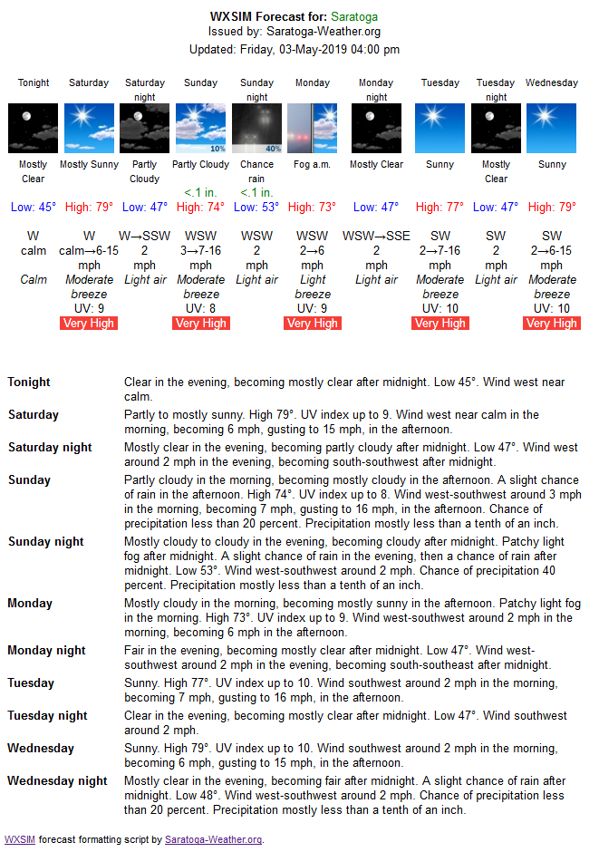
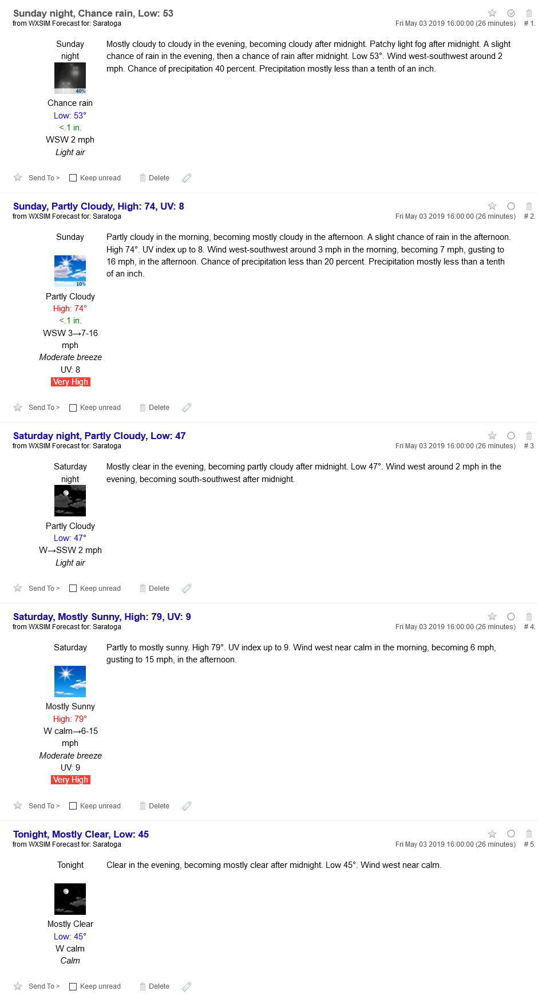

# WXSIM forecast formatting scripts

Tom Ehrensberger has created a great program called [WXSIM](https://www.wxsim.com/) to create text weather forecasts based on observation data from public sources and your own weather station. The program produces a text file (plaintext.txt) that has a detailed forecast like this:

```
WXSIM text forecast for Saratoga, initialized at  4:00 PM May 3, 2019
_______________________________________________________________________________

Tonight: Clear in the evening, becoming mostly clear after midnight. Low 45.
Wind west near calm.

Saturday: Partly to mostly sunny. High 79. UV index up to 9. Wind west near calm
in the morning, becoming 6 mph, gusting to 15 mph, in the afternoon.

Saturday night: Mostly clear in the evening, becoming partly cloudy after
midnight. Low 47. Wind west around 2 mph in the evening, becoming
south-southwest after midnight.

Sunday: Partly cloudy in the morning, becoming mostly cloudy in the afternoon. A
slight chance of rain in the afternoon. High 74. UV index up to 8. Wind
west-southwest around 3 mph in the morning, becoming 7 mph, gusting to 16 mph,
in the afternoon. Chance of precipitation less than 20 percent. Precipitation
mostly less than a tenth of an inch.

Sunday night: Mostly cloudy to cloudy in the evening, becoming cloudy after
midnight. Patchy light fog after midnight. A slight chance of rain in the
evening, then a chance of rain after midnight. Low 53. Wind west-southwest
around 2 mph. Chance of precipitation 40 percent. Precipitation mostly less than
a tenth of an inch.

Monday: Mostly cloudy in the morning, becoming mostly sunny in the afternoon.
Patchy light fog in the morning. High 73. UV index up to 9. Wind west-southwest
around 2 mph in the morning, becoming 6 mph in the afternoon.

Monday night: Fair in the evening, becoming mostly clear after midnight. Low 47.
Wind west-southwest around 2 mph in the evening, becoming south-southeast after
midnight.

Tuesday: Sunny. High 77. UV index up to 10. Wind southwest around 2 mph in the
morning, becoming 7 mph, gusting to 16 mph, in the afternoon.

Tuesday night: Clear in the evening, becoming mostly clear after midnight. Low
47. Wind southwest around 2 mph.

Wednesday: Sunny. High 79. UV index up to 10. Wind southwest around 2 mph in the
morning, becoming 6 mph, gusting to 15 mph, in the afternoon.

Wednesday night: Mostly clear in the evening, becoming fair after midnight. A
slight chance of rain after midnight. Low 48. Wind west-southwest around 2 mph.
Chance of precipitation less than 20 percent. Precipitation mostly less than a
tenth of an inch.

* THIS FORECAST WAS MADE IN AUTOMATED MODE AND MAY BE LESS ACCURATE THAN OTHERWISE *
```

and produce an output like this:



These scripts will read the plaintext.txt forecast and produce other displays of the information including condition icons, and translate the English to other languages.

## plaintext-parser.php (NOAA-style WXSIM forecast display - multilingual)

I started this script based on an idea from [Gerard](http://www.doornenburgweer.nl/) in the Netherlands. He had adapted [Jordan Gerth's wsofd.php](http://www.wiscwx.com/jordan/wsofd/index.html) script to convert the plaintext.txt English forecast into Dutch. (see the [Weather-Watch.com thread here](http://www.weather-watch.com/smf/index.php/topic,23415.msg183157.html#msg183157)).  
I thought this was a great idea to make WXSIM output available in multiple languages. I wrote the plaintext-parser.php to create a [carterlake-style forecast output](scripts-carterlake.php#carterlake) that would use the [Saratoga icon set](saratoga-icons2.zip), would be easy to include in a weather website, and have built-in support for translations to other languages.

My special thanks go to [Jordan Gerth](http://www.wiscwx.com/jordan/wsofd/index.html) for creating the first set of plaintext.txt parsing/display functions, to Gerard for his pioneering work on a Dutch translation, and to the folks who generated the language translation files (listed below) that this script uses. Thanks to your all! I hope you enjoy the script/translations .. this was truly an international effort.

The plaintext.txt forecast by WXSIM is a shorthand form of the English language which is easily recognizable by native speakers, as similar words/phrases are used by our National Weather Service, TV, radio and newspapers. This "weather speak" usually has only nouns and adjectives (with prepositions, conjunctions and articles) and no verbs, so it is not necessarily a fully grammatical English sentence. Likewise, the translations are not intended to be full translations (since they also have no verbs), but are recognizable and informative to native speakers as "weather speak", just like the English "weather speak' from which they are derived.

The translation is performed by an ordered set of substitutions arranged in the plaintext-parser-lang-XX.txt file which is applied to the English plaintext.txt output of WXSIM. The result is a set of Icons depicting the prevailing condition during the period, along with the High/Low temperature and UV Index forecast. The text part of the forecast is translated in the same manner. If no language file is found, the forecast defaults to English.

## Settings in the plaintext-parser.php script
```
// Settings ---------------------------------------------------------------
$iconDir ='./forecast/images/';           // directory for carterlake icons
$iconType = '.jpg';        // default type='.jpg' -- use '.gif' for animated icons from http://www.meteotreviglio.com/
$WXSIMstation = "Saratoga-Weather.org";   // name of your weather station
$plaintextFile = './plaintext.txt';       // location of the WXSIM plaintext.txt
$lang = 'en';                             // default language is 'en' = English
$tempDegrees = '°';                   // set to '' to omit degree sign
//                                        //   or set to '°', '°F' or '°C'
$maxIcons = 10;                           // set to maximum number of icons to display
$maxWidth = '640px';                      // max width of tables (could be '100%')
$minPoP = '40';                           // PoP must be this or above to display
//                                        // rain icon, otherwise sky icon w/PoP displayed.
$showBeaufort = 'T';					  // set to false to not display Beaufort at all
//										  // ='V' for 'n Bft', ='T' for translated name
$showHumidex = true;                      // =true to display Humidex (Hdx), =false to suppress display
$showFrost = true;                        // =true to display frost, =false to suppress display
$showHeatIDX = true;                      // =true to display Heat-Index (HI), =false to suppress display
$showHotIconF = 100;                      // show Hot icon if Heat-Index >= value
$showHotIconC = 37.7;                     // show Hot icon if Humidex >= value
//
$showWindChill = true;                    // =true to display Wind-Chill, =false to suppress display
$showColdvalF = 26;                      // show Cold! if Wind-Chill <= value in F
$showColdvalC = -3;                      // show Cold! if Wind-Chill <= value in C
$uomTemp   = 'C';                        // ='C' if forecast temperature in Centigrade, ='F' if in Fahrenheit
// ---- end of settings ---------------------------------------------------
```

Make sure that $iconDir points to the relative URL address of your carterlake Icon set, and that $plaintextFile points to the relative URL address of your WXSIM plaintext.txt file on your website.  
Change $WXSIMstation to the text you'd like to appear in the heading of the forecast page.  
Change $lang to to the ISO abbreviation for the country from the language files listed below (if you want to change the default language from English).

More documentation is contained in the script itself about variable names/arrays made available, and the contents. The samples below serve to illustrate some of the possible usages on your weather website.

## Usage samples
```
<?php  
$doInclude = true;  
include("plaintext-parser.php"); ?>
```

will show:  


You can also include it 'silently' and print just a few (or all) the contents where you'd like it on the page
```
<?php  
$doPrint = false;  
include("plaintext-parser.php"); ?>  
```

then on your page, the following code would display just the current and next time period forecast:
```
<table>  
<tr align="center" valign="top">  
<?php print "<td>$WXSIMicons[0]</td><td>$WXSIMicons[1]</td>\n"; ?>  
</tr>  
<tr align="center" valign="top">  
<?php print "<td>$WXSIMtemp[0]</td><td>$WXSIMtemp[1]</td>\n"; ?>  
</tr>  
</table>
```

Or if you'd like to include the immediate forecast with text for the next two cycles:
```
<table>  
<tr valign="top">  
<?php print "<td align=\"center\">$WXSIMicons[0]<br />$WXSIMtemp[0]</td>\n"; ?>  
<?php print "<td align=\"left\" valign=\"middle\">$WXSIMtext[0]</td>\n"; ?>  
</tr>  
<tr valign="top">  
<?php print "<td align=\"center\">$WXSIMicons[1]<br />$WXSIMtemp[1]</td>\n"; ?>  
<?php print "<td align=\"left\" valign=\"middle\">$WXSIMtext[1]</td>\n"; ?>  
</tr>  
</table>
```

You can also present the NWS and WXSIM forecasts together by using:

```
<?php $doPrintNWS = false; include("advforecast2.php"); ?>  
<?php $doPrint = false; include("plaintext-parser.php"); ?>  

<table>  
<tr><th align="center">NWS</th><th align="center">WXSIM</th><th>Forecast</th></tr>  
<tr valign="top">  
<?php print "<td align=\"center\">$forecasticons[0]<br />$forecasttemp[0]</td>\n"; ?>  
<?php print "<td align=\"center\">$WXSIMicons[0]<br />$WXSIMtemp[0]</td>\n"; ?>  
<?php print "<td align=\"left\" valign=\"middle\">NWS: $forecasttext[0]<br/><br/>  
WXSIM: $WXSIMtext[0]</td>\n"; ?>  
</tr>  
<tr valign="top">  
<?php print "<td align=\"center\">$forecasticons[1]<br />$forecasttemp[1]</td>\n"; ?>  
<?php print "<td align=\"center\">$WXSIMicons[1]<br />$WXSIMtemp[1]</td>\n"; ?>  
<?php print "<td align=\"left\" valign=\"middle\">NWS: $forecasttext[1]<br/><br/>  
WXSIM: $WXSIMtext[1]</td>\n"; ?>  
</tr>  
</table>  
```

If you'd like to style the output, you can easily do so by setting a CSS for class **WXSIMforecast** either in your CSS file or on the page including the plaintext-parser.php (in include mode):
```
<style type="text/css">    
.WXSIMforecast {    
    font-family: Verdana, Arial, Helvetica, sans-serif;    
    font-size: 9pt;    
}    
</style>
```
## Installation of plaintext-parser.php

Download **plaintext-parser.php** and **plaintext-parser-data.txt** with this package and place in same directory on your website. The document root directory is preferred, although the script can be located in a subdirectory as long as the relative addressing of the icons is changed in the script.

Download the **Icon set** and upload to ./forecast/images directory.

Change settings in **plaintext-parser.php** to reflect location of your plaintext.txt file from WXSIM and the relative URL address of the icons if necessary and upload the modified plaintext-parser.php to your website.

For additional languages, download one or more language plugin files and upload to the same directory as the plaintext-parser.php. You can change plaintext-parser '$lang =' setting to the default language of your choice.

**Optional language translation plugins:** (install in same directory as plaintext-parser.php)

<table width="100%" cellspacing="3" cellpadding="2" border="0">

<tbody>

<tr>

<th style="width: 11%" scope="col">Language</th>

<th style="width: 6%" scope="col">Demo</th>

<th style="width: 26%" scope="col">Download  
<small>(right click, save file)</small></th>

<th style="width: 25%" scope="col">Updated (UTC)</th>

<th style="width: 32%" scope="col">Translation thanks to:</th>

</tr>

<tr>

<td>Afrikaans</td>

<td>[**Demo**](https://saratoga-weather.org/plaintext-parser.php?lang=ct#sample)</td>

<td>[**plaintext-parser-lang-af.txt**](plaintext-parser-lang-af.txt)</td>

<td>22 Feb 2019 19:03:18</td>

<td>Jens at [Namibia Weather](http://weather.namsearch.com/)</td>

</tr>

<tr>

<td>Bulgarian</td>

<td>[**Demo**](https://saratoga-weather.org/plaintext-parser.php?lang=bg#sample)</td>

<td>[**plaintext-parser-lang-bg.txt**](plaintext-parser-lang-bg.txt)</td>

<td>22 Feb 2019 19:03:18</td>

<td>Radmil at [vremeto.org](http://www.vremeto.org/wxsim)</td>

</tr>

<tr>

<td>Catalan</td>

<td>[**Demo**](https://saratoga-weather.org/plaintext-parser.php?lang=ct#sample)</td>

<td>[**plaintext-parser-lang-ct.txt**](plaintext-parser-lang-ct.txt)</td>

<td>22 Feb 2019 19:03:18</td>

<td>Pere at [casacota.cat](http://www.casacota.cat/)</td>

</tr>

<tr>

<td>Danish</td>

<td>[**Demo**](https://saratoga-weather.org/plaintext-parser.php?lang=dk#sample)</td>

<td>[**plaintext-parser-lang-dk.txt**](plaintext-parser-lang-dk.txt)</td>

<td>22 Feb 2019 19:03:18</td>

<td>Henrik at [silkeborg-vejret.dk](http://www.silkeborg-vejret.dk/)</td>

</tr>

<tr>

<td>Dutch</td>

<td>[**Demo**](https://saratoga-weather.org/plaintext-parser.php?lang=nl#sample)</td>

<td>[**plaintext-parser-lang-nl.txt**](plaintext-parser-lang-nl.txt)</td>

<td>22 Feb 2019 19:03:18</td>

<td>Oebel at [Weerstation Marsdijk.nl](http://www.weerstation-marsdijk.nl/)</td>

</tr>

<tr>

<td>Finnish</td>

<td>[**Demo**](https://saratoga-weather.org/plaintext-parser.php?lang=fi#sample)</td>

<td>[**plaintext-parser-lang-fi.txt**](plaintext-parser-lang-fi.txt)</td>

<td>22 Feb 2019 19:03:18</td>

<td>Henkka at [nordicweather.net](http://www.nordicweather.net/)</td>

</tr>

<tr>

<td>French</td>

<td>[**Demo**](https://saratoga-weather.org/plaintext-parser.php?lang=fr#sample)</td>

<td>[**plaintext-parser-lang-fr.txt**](plaintext-parser-lang-fr.txt)</td>

<td>22 Feb 2019 19:03:18</td>

<td>Brian at [cypenv.org](http://www.cypenv.org/weather/wx.htm)</td>

</tr>

<tr>

<td>German</td>

<td>[**Demo**](https://saratoga-weather.org/plaintext-parser.php?lang=de#sample)</td>

<td>[**plaintext-parser-lang-de.txt**](plaintext-parser-lang-de.txt)</td>

<td>22 Feb 2019 19:03:18</td>

<td>Fredi at [abc-laboratory.com](http://www.abc-laboratory.com/)</td>

</tr>

<tr>

<td>Greek</td>

<td>[**Demo**](https://saratoga-weather.org/plaintext-parser.php?lang=el#sample)</td>

<td>[**plaintext-parser-lang-el.txt**](plaintext-parser-lang-el.txt)</td>

<td>22 Feb 2019 19:03:18</td>

<td>Thanos at [meteothes.gr](http://www.meteothes.gr/)</td>

</tr>

<tr>

<td>Italian</td>

<td>[**Demo**](https://saratoga-weather.org/plaintext-parser.php?lang=it#sample)</td>

<td>[**plaintext-parser-lang-it.txt**](plaintext-parser-lang-it.txt)</td>

<td>22 Feb 2019 19:03:18</td>

<td>Alessandro at [meteocarmignano.it](http://www.meteocarmignano.it/)</td>

</tr>

<tr>

<td>Hebrew</td>

<td>[**Demo**](https://saratoga-weather.org/plaintext-parser.php?lang=he#sample)</td>

<td>[**plaintext-parser-lang-he.txt**](plaintext-parser-lang-he.txt)</td>

<td>22 Feb 2019 19:03:18</td>

<td>Eli at [evweather.info](http://www.evweather.info/)</td>

</tr>

<tr>

<td>Hungarian</td>

<td>[**Demo**](https://saratoga-weather.org/plaintext-parser.php?lang=hu#sample)</td>

<td>[**plaintext-parser-lang-hu.txt**](plaintext-parser-lang-hu.txt)</td>

<td>22 Feb 2019 19:03:18</td>

<td>Attila at [huweather.com](http://www.huweather.com/)</td>

</tr>

<tr>

<td>Norwegian</td>

<td>[**Demo**](https://saratoga-weather.org/plaintext-parser.php?lang=no#sample)</td>

<td>[**plaintext-parser-lang-no.txt**](plaintext-parser-lang-no.txt)</td>

<td>22 Feb 2019 19:03:18</td>

<td>Ronny at [lynradar.no](http://www.lynradar.no)</td>

</tr>

<tr>

<td>Polish</td>

<td>[**Demo**](https://saratoga-weather.org/plaintext-parser.php?lang=pl#sample)</td>

<td>[**plaintext-parser-lang-pl.txt**](plaintext-parser-lang-pl.txt)</td>

<td>22 Feb 2019 19:03:18</td>

<td>Andrezej at [Andretti.pl](http://andretti.pl/)</td>

</tr>

<tr>

<td>Portuguese</td>

<td>[**Demo**](https://saratoga-weather.org/plaintext-parser.php?lang=pt#sample)</td>

<td>[**plaintext-parser-lang-pt.txt**](plaintext-parser-lang-pt.txt)</td>

<td>22 Feb 2019 19:03:18</td>

<td>Hélder at [Meteoabrantes](http://meteoabrantes.no-ip.info/)</td>

</tr>

<tr>

<td>Spanish</td>

<td>[**Demo**](https://saratoga-weather.org/plaintext-parser.php?lang=es#sample)</td>

<td>[**plaintext-parser-lang-es.txt**](plaintext-parser-lang-es.txt)</td>

<td>22 Feb 2019 19:03:18</td>

<td>Luis at [Aerolugo](http://aerolugo.com/estmeteo/)</td>

</tr>

<tr>

<td>Swedish</td>

<td>[**Demo**](https://saratoga-weather.org/plaintext-parser.php?lang=se#sample)</td>

<td>[**plaintext-parser-lang-se.txt**](plaintext-parser-lang-se.txt)</td>

<td>22 Feb 2019 19:03:18</td>

<td>Bo at [Lerum](http://www.sm6kiw.se/)</td>

</tr>

<tr>

<td>Slovenian</td>

<td>[**Demo**](https://saratoga-weather.org/plaintext-parser.php?lang=se#sample)</td>

<td>[**plaintext-parser-lang-si.txt**](plaintext-parser-lang-si.txt)</td>

<td>22 Feb 2019 19:03:18</td>

<td>Markos at [Okroglo](http://www.okroglovreme.com/)</td>

</tr>

</tbody>

</table>

Note: if you'd like to generate a language translation file for a new language, please let me know .. I'm happy to support your efforts!


# plaintext-rss.php - WXSIM Forecast RSS Feed Script

This script is an add-on to the plaintext-parser.php script described above. The script will generate a [valid RSS 2.0](http://feedvalidator.org/check.cgi?url=http%3A//saratoga-weather.org/plaintext-rss.php) XML feed for your forecast. with full support for all language translations supplied with plaintext-parser.php.

To install,  place plaintext-parser-rss.php in the **SAME DIRECTORY** as plaintext-parser.php. Then change the settings in plaintext-rss.php to match your local configuration:
```
// Settings ---------------------------------------------------------------
//
  $ourTZ = "PST8PDT";  //NOTE: this *MUST* be set correctly to
// translate UTC times to your LOCAL time for the displays.
//  http://saratoga-weather.org/timezone.txt  has the list of timezone names
//  pick the one that is closest to your location and put in $ourTZ
// also available is the list of country codes (helpful to pick your zone
//  from the timezone.txt table
//  http://saratoga-weather.org/country-codes.txt : list of country codes
  $ourLinkPage = '/WXSIM-forecast.php'; // set to your page name to display
//				// the full forecast using your template
  $ourEmail = 'webmaster@saratoga-weather.org';  // set to your email address
//
  $absIconDir = '/forecast/images/'; // set to absolute web address of images
//                                       without './' or '../' and include
//                                       trailing '/'
// ---- end of settings ---------------------------------------------------

Set **$ourTZ** to the timezone for your forecast.  
Set **$ourLinkPage** to the relative (from the document root of your website) address for your detailed WXSIM forecast page.  
Set **$ourEmail** to YOUR email address (webmaster@your.site.com).  
Set **$absIconDir** to the web address of your Icons directory (starting at the document root of your website). This is probably the most vexing setting to make as it has to be perfect to make the images appear in the RSS feed. It should be the same as the plaintext-parser.php $iconDir with all the relative addressing resolved. Here's some samples to give you an idea about how it should be set. it assumes that the icons are in ./forecast/images/ dir :

<table width="100%" cellspacing="3" cellpadding="2" border="0">

<tbody>

<tr>

<th style="width: 52%" scope="col">Website URL</th>

<th style="width: 24%" scope="col">

plaintext-parser.php  
$iconDir

</th>

<th style="width: 24%" scope="col">plaintext-rss.php  
$absIconDir</th>

</tr>

<tr>

<td>http://some.site.com/plaintext-rss.php</td>

<td>**./forecast/images/**</td>

<td>**/forecast/images/**</td>

</tr>

<tr>

<td>http://some.site.com/subdir/plaintext-rss.php</td>

<td>**./forecast/images/**</td>

<td>**/subdir/forecast/images/**</td>

</tr>

<tr>

<td>http://some.site.com/subdir/plaintext-rss.php</td>

<td>**/forecast/images/**</td>

<td>**/forecast/images/**</td>

</tr>

<tr>

<td>http://some.site.com/subdir/dir2/plaintext-rss.php</td>

<td>**../forecast/images/**</td>

<td>**/subdir/forecast/images/**</td>

</tr>

</tbody>

</table>

## Sample RSS output displayed in browser


